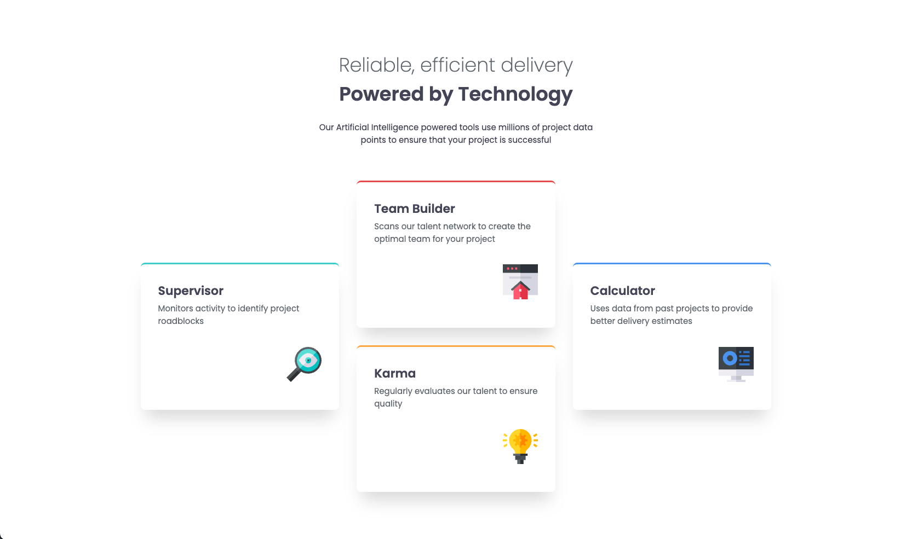
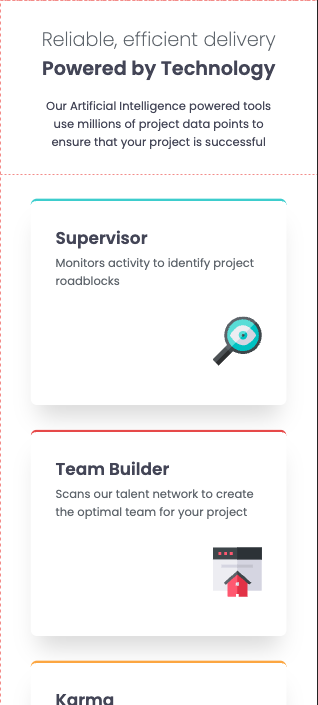

# Frontend Mentor - QR code component solution

This is a solution to the [QR code component challenge on Frontend Mentor](https://www.frontendmentor.io/challenges/qr-code-component-iux_sIO_H). Frontend Mentor challenges help you improve your coding skills by building realistic projects. 

## Table of contents

- [Overview](#overview)
  - [Screenshot](#screenshot)
  - [Links](#links)
- [My process](#my-process)
  - [What I learned](#what-i-learned)
- [Author](#author)

**Note: Delete this note and update the table of contents based on what sections you keep.**

## Overview

### Screenshot

- Mobile design



- Desktop design



### Links

- Solution URL: [Repo](https://github.com/ibzan79/frontend-product-preview)
- Live Site URL: [Live site](https://ibzan79.github.io/frontend-product-preview/)

## My process

### What I learned

- Responsive desktop design
```css
@media (min-width: 768px) {
    .header-page h1 {
        font-size: 2.2rem;
    }

    .cards {
        display: grid;
        grid-template-columns: repeat(3, 1fr);
        grid-template-rows: repeat(2, auto);
        max-width: 72rem;
        margin: 2rem auto;
    }

    .card--team-builder {
        grid-column: 2;
        grid-row: 1;
    }

    .card--karma {
        grid-column: 2;
        grid-row: 2;
    }

    .card--supervisor {
        grid-column: 1;
        grid-row: 1 / span 2;
        align-self: center;
    }

    .card--calculator {
        grid-column: 3;
        grid-row: 1 / span 2;
        align-self: center;
    }
}
```

## Author

- Frontend Mentor - [@ibzan79](https://www.frontendmentor.io/profile/ibzan79)  
- GitHub - [ibzan79](https://github.com/ibzan79)
